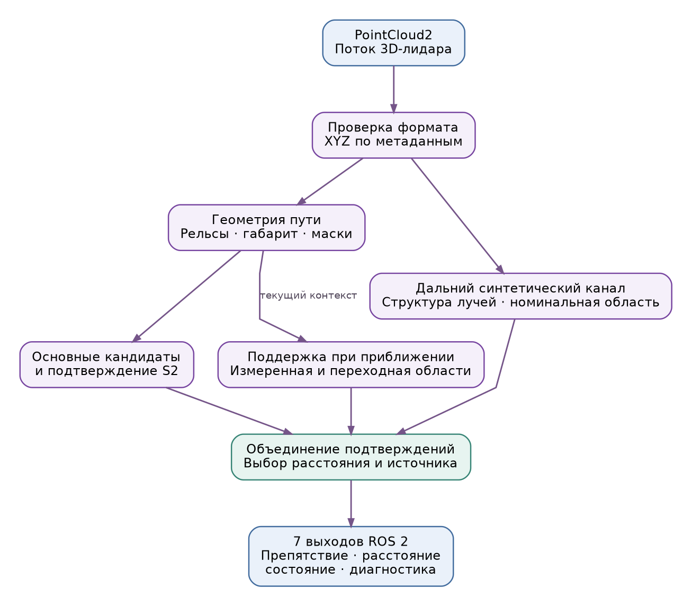
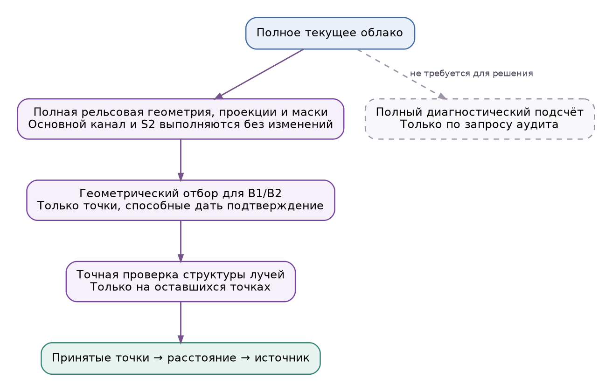

# Архитектура решения

[К началу](../README.md)

Решение разделяет алгоритмическое ядро и ROS-обвязку. Только `node.py` импортирует ROS; адаптер PointCloud2 и вычислительное ядро можно проверять отдельно.

## Компоненты

| Компонент | Назначение | Исходный файл |
|---|---|---|
| ROS-узел | Подписка, параметры, обработка входов и публикация семи выходов | `node.py` |
| Адаптер облака | Чтение именованных XYZ с учётом порядка байтов и шагов памяти | `pointcloud_adapter.py` |
| Рельсовая опора | Поиск головок рельсов, плоскость, осевая линия, поддержанный интервал | `near/rail_geometry.py`, `near/rail_reference.py`, `near/centerline.py` |
| Основные кандидаты | Габарит, маски штатной геометрии, компоненты и проверки свидетельств | `near/detector.py`, `near/candidate.py` |
| Временное подтверждение | Короткая причинная история разреженных наблюдений, правило S2 | `sparse_tracker.py` |
| Дальний синтетический канал | Проверка структуры лучей и внутренней области номинальной системы | `far.py` |
| Поддержка при приближении | Геометрически ограниченные запросы B1/B2 к тому же лучевому признаку | `handoff.py` |
| Итоговый выбор | Объединение ветвей, ближайшее допустимое расстояние и источник | `detector.py`, `v3_detector.py` |

Пути в таблице указаны относительно `src/foreign_object_detector/foreign_object_detector/`. Имена совместимых модулей с `v1/v2/v3` внутри пакета являются зависимостями текущей реализации, а не отдельными вариантами для выбора проверяющим.

## Порядок вычислений

Полная геометрия текущего облака и её контекстные маски вычисляются **до** отбора точек для дополнительных ветвей. Операционный путь переиспользует эти результаты и сначала проверяет геометрическую допустимость. Точный лучевой предикат считается только для оставшихся точек.

Глобальный счётчик всех несогласованных с лучами точек ниже 60 м не участвует в решении. В рабочем режиме его значение `null`; при включённом аудите он вычисляется полностью. Допуск предиката и состав принятых точек от этого не меняются.

C++17-селектор ускоряет лучевую проверку. На численно неоднозначных границах выполняется исходная арифметика NumPy. Если нативная библиотека недоступна, используется NumPy-резерв. Флаги сборки запрещают `fast-math` и свёртку FMA.

## Память и состояние

Уточнения одинаковых задач переиспользуются в пределах одного кадра. Результаты геометрии не переносятся между кадрами. Дальний канал не хранит историю объектов; временное состояние есть у разреженного подтверждения S2. Разрывы времени, возврат времени назад, ошибочный вход и изменение параметров сбрасывают соответствующее состояние.

Входная очередь: best-effort, volatile, depth=1. Однопоточная обработка не создаёт дополнительную прикладную очередь устаревших кадров. Транспорт использует настроенный Fast DDS с общей памятью для локальных процессов и UDP-резервом. Схема запуска: [Развёртывание](DEPLOYMENT.md).

## Границы ответственности

Узел выдаёт результаты восприятия. Он не управляет торможением и не предоставляет карту, внешнюю одометрию или нейросетевой прогноз. Дополнительные синтетические каналы отделены от измеренной рельсовой геометрии. Смысл каждой ветви и расстояния раскрыт в [алгоритме](ALGORITHM.md) и [контракте API](API.md).
