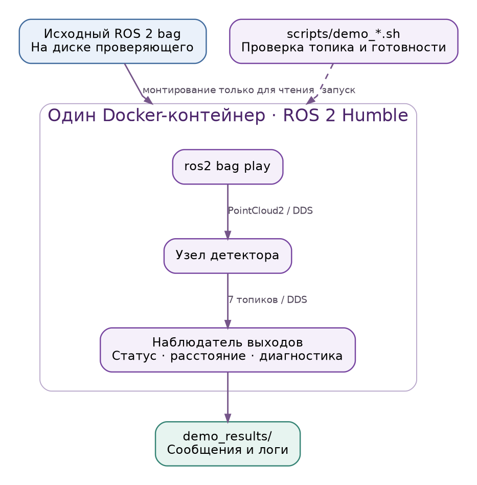

# Сборка и воспроизведение

[К началу](../README.md)

Целевая программная среда: Ubuntu 22.04, ROS 2 Humble, Docker, `linux/amd64`. Собранный контейнер содержит зависимости и не скачивает данные при работе. Исходные bag предоставляются отдельно.

## 1. Сборка

```bash
docker build --platform linux/amd64 -t lidar-near:v5-query-first-ru .
```

Dockerfile использует закреплённый образ ROS Humble/Jammy и автоматически выполняет `colcon build`. При наличии компилятора собирается точный C++17-селектор; без него сохраняется NumPy-резерв. Численные флаги сборки находятся в `src/foreign_object_detector/setup.py`.

Сборка без кэша требует доступного базового образа и apt-пакетов. Экспорт готового Docker-образа не вложен в Git-снимок. При получении отдельного файла образа его можно загрузить:

```bash
gzip -dc lidar-near-v5-query-first-ru-amd64.tar.gz | docker load
```

## 2. Короткая воспроизводимая демонстрация



```bash
bash scripts/demo_synthetic.sh /absolute/path/to/cloud_with_fake_obj
bash scripts/demo_real.sh /absolute/path/to/real_bag
```

Аргументы каждого сценария: каталог bag, коэффициент воспроизведения, интервал исходного времени в секундах, начальное смещение в секундах. Значения по умолчанию: синтетика `0.1 1.2 0`, реальная запись `0.2 1.2 0`.

```bash
bash scripts/demo_synthetic.sh /absolute/path/to/cloud_with_fake_obj 0.1 2.4 76.95
```

Это ограниченная функциональная демонстрация, не нагрузочная проверка 10 Гц. Сценарий ожидает не менее трёх входов и поступление каждого из семи выходов; он не требует обязательного препятствия в произвольно выбранном интервале. Файлы `observations.json`, `detector.log`, `player.log` сохраняются в новом подкаталоге `demo_results/`.

Встроенные сценарии принимают `/lidar_points`. Для другой записи сначала прочитайте метаданные:

```bash
BAG_DIR="/absolute/path/to/bag"
docker run --rm --platform linux/amd64 --network none \
  -v "$BAG_DIR:/bag:ro" lidar-near:v5-query-first-ru \
  ros2 bag info /bag
```

Для топика, отличающегося от `/lidar_points`, используйте интерактивный запуск ниже.

## 3. Интерактивный запуск в одном контейнере

Этот способ сохраняет плеер, детектор и наблюдателей в одной сетевой области. Он подходит для локальной демонстрации, в том числе на Docker Desktop.

```bash
BAG_DIR="/absolute/path/to/bag"
INPUT_TOPIC="/lidar_points"

docker run -d --name neapy-demo --platform linux/amd64 \
  --network none --shm-size=256m -e ROS_DOMAIN_ID=42 \
  -v "$BAG_DIR:/bag:ro" -v "$PWD/scripts:/checks:ro" \
  lidar-near:v5-query-first-ru \
  ros2 launch foreign_object_detector detector.launch.py \
  input_topic:="$INPUT_TOPIC"
```

В отдельных терминалах откройте наблюдение, затем запустите плеер:

```bash
docker exec -it neapy-demo /detector_entrypoint.sh ros2 topic echo /foreign_object/state
docker exec -it neapy-demo /detector_entrypoint.sh ros2 topic echo /foreign_object/distance
docker exec -it neapy-demo /detector_entrypoint.sh \
  ros2 bag play /bag --topics /lidar_points --read-ahead-queue-size 8 --rate 0.1
```

В команде плеера укажите тот же входной топик, что и в `INPUT_TOPIC`. После окончания:

```bash
docker stop --signal SIGINT --timeout 15 neapy-demo
docker rm neapy-demo
```

Если имя контейнера уже занято, сначала проверьте существующий контейнер; не удаляйте чужой процесс. Для проверки свежести во время работы:

```bash
docker exec -it neapy-demo /detector_entrypoint.sh \
  python3 /checks/watch_outputs.py --timeout 5
```

## 4. Внешний публикатор на Linux

```bash
docker run --rm --platform linux/amd64 --network host --shm-size=256m \
  -e ROS_DOMAIN_ID=42 lidar-near:v5-query-first-ru
```

В окружении ROS 2 Humble на той же Linux-машине задайте соответствующие параметры до запуска публикатора:

```bash
export ROS_DOMAIN_ID=42
export FASTRTPS_DEFAULT_PROFILES_FILE="$PWD/transport/fastdds.xml"
ros2 bag play /absolute/path/to/bag --topics /lidar_points --read-ahead-queue-size 8
```

Профиль задаёт 64 MiB общей памяти на участника и UDP-резерв. Для проверенной совместной схемы контейнер получает 256 MiB `/dev/shm`. При раздельных контейнерах или внешней сети проверьте DDS-discovery, сетевую доступность, IPC и QoS. Само наличие `--network host` не гарантирует общую память между произвольными процессами; измеренные результаты относятся к совместному размещению внутри контейнера.

## 5. Резервный режим

```bash
docker run --rm --platform linux/amd64 --network host --shm-size=256m \
  lidar-near:v5-query-first-ru \
  ros2 launch foreign_object_detector detector.launch.py \
  config:=/opt/detector/install/foreign_object_detector/lib/python3.10/site-packages/foreign_object_detector/config/v4_fallback.yaml
```

Этот профиль отключает дополнительные B1/B2, сохраняя исходный ближний канал, дальний синтетический канал и переиспользование уточнений. Основная конфигурация использует B1/B2. Короткое расширение A остаётся выключенным в обоих режимах.

## 6. Диагностика запуска

| Наблюдение | Что проверить |
|---|---|
| Нет свежих выходов | Каталог bag, имя топика, работа плеера, ROS_DOMAIN_ID, discovery и сеть |
| Вход отклонён | Поля XYZ должны быть scalar FLOAT32; смещения, row_step и размер буфера должны быть корректны |
| `TRACK_UNRELIABLE` | Достаточность рельсовой опоры, а не только наличие облака |
| Время вернулось назад | При повторе bag состояние S2 сбрасывается; дождитесь новых наблюдений |
| Низкая частота в эмуляции | Проверьте платформу процесса и условия воспроизведения; эмуляция не заменяет нативный замер |

Логи и машинные коды описаны в [API](API.md). Отдельные сохранённые сообщения не следует использовать как свежий результат после остановки входа.
