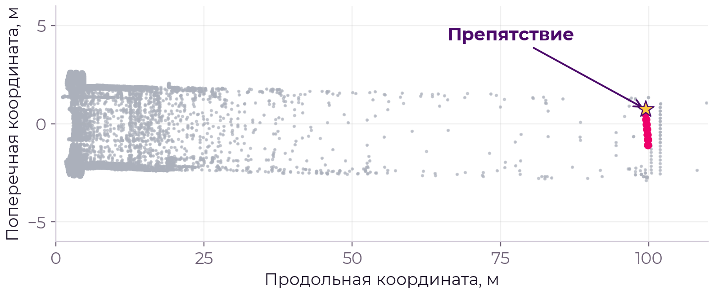
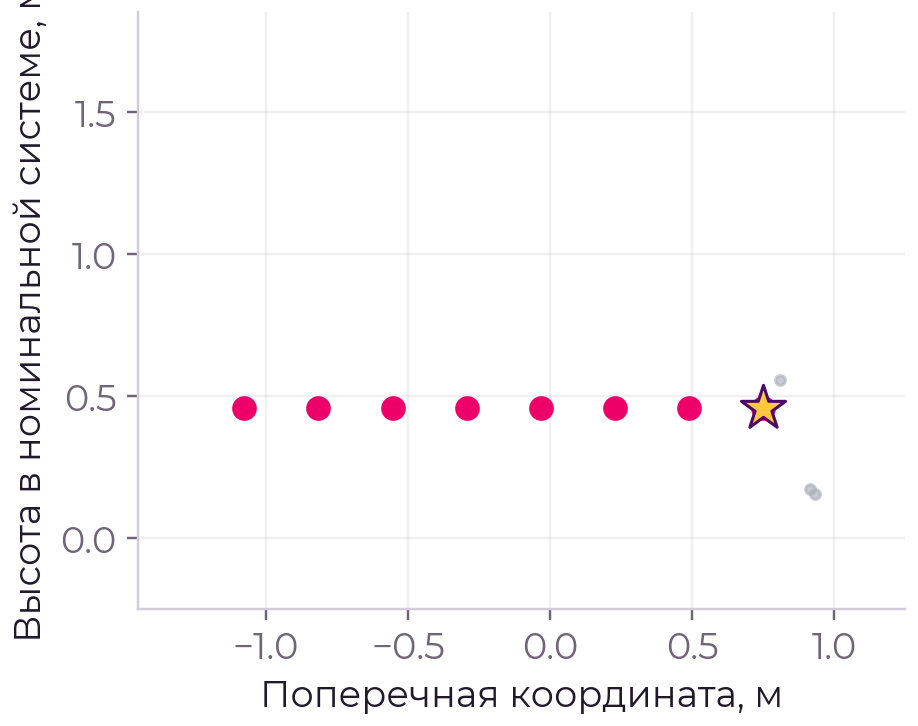
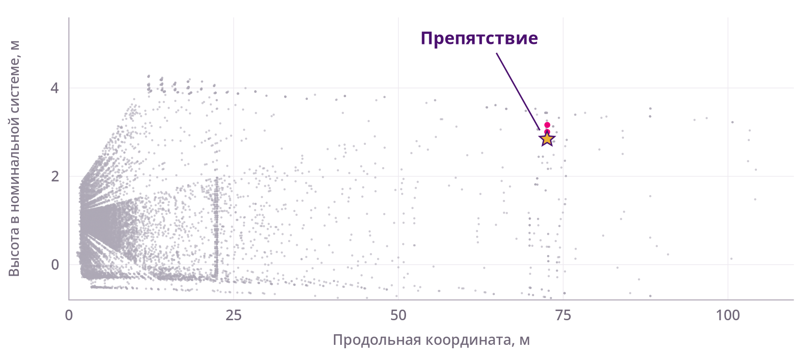
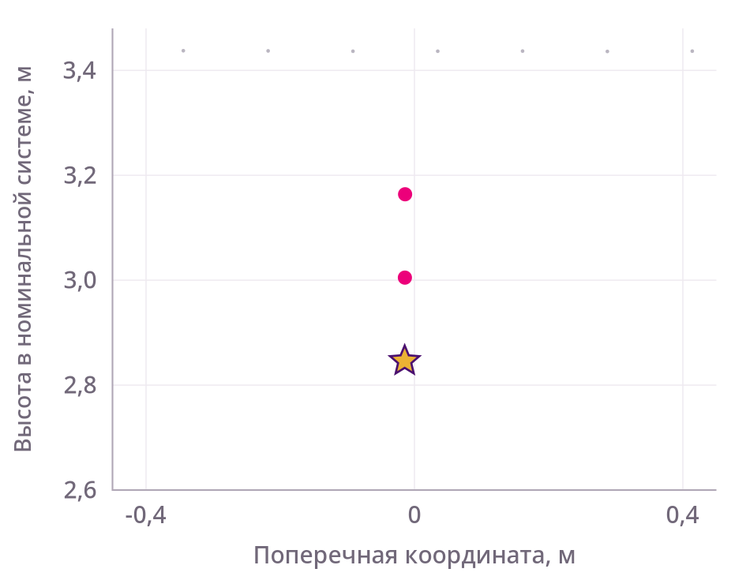

# Результаты проверки

[К началу](../README.md) · [Числовые данные JSON](results.json)

Здесь приведены результаты **итоговой конфигурации** с включёнными B1/B2 и выключенным расширением A. Это измерения на предоставленных данных разработки. Разные строки таблиц относятся к разным проверкам и не складываются в единый показатель точности.

## Прямо проверенные примеры обнаружения

| Пример | Сценарий | Опубликованное расстояние |
|---|---|---:|
| E1, кадр 0 | Крупное препятствие | 98,683547 м |
| E4, кадр 427 | Объект у края габарита | 99,102107 м |
| E9, кадр 686 | Низкое препятствие поперёк пути | 99,421508 м |
| E10, кадр 763 | Тонкий подвешенный предмет | 72,558733 м |

Это предоставленные синтетические вставки. Расстояние в таблице является продольной координатой выбранной точки в номинальной системе N1, а не длиной кривого железнодорожного пути.

На рисунках использованы сохранённые точки. Подсветка объекта поясняет проверочный пример; выбранная детектором точка отмечена отдельно. Поясняющая разметка не является обещанием полноценной сегментации.

## Разреженное свидетельство: тонкий подвешенный предмет

В прямо проверенном синтетическом примере E10/frame763 сохранены три наблюдаемые точки объекта. Одна проходит итоговое внутреннее условие. Опубликованное расстояние выбранной точки: **72,558733 м** вдоль номинальной оси. Это результат конкретного примера, не общее правило дальности для всех тонких предметов.

Для воспроизводимости иллюстраций приложены [источники и определения выделения](assets/examples_provenance.json). Исходные облака не включены в Git и не используются как эталоны внутри runtime.

## Качество на выбранных наблюдениях

| Набор | Результат |
|---|---:|
| Выбранные наблюдения с ожидаемым обнаружением | 13 из 21 дали целевой результат |
| Выбранные наблюдения с ожидаемым игнорированием | 2 тревоги из 12 |
| Полные фоновые контрольные входы | 4 положительных из 702 |
| Реальные контрольные входы | 0 положительных из 193 |

Сохраняются 29 условных IGNORE-наблюдений и 81 условный пропуск на подходе в принятой схеме атрибуции. Последняя величина учитывает только кадры с текущими ранее привязанными к объекту точками между граничными наблюдениями; это не полная покадровая разметка.

Шесть дополнительных кадров 775–778 и 792–793 остаются неразмеченными и не засчитываются как подтверждённые успехи. 13/21 не является общей полнотой обнаружения, а 0/193 не доказывает нулевую частоту ложных тревог в эксплуатации.

Отдельный ближний пример E10/frame785 подтверждён на 36,719130 м по оценке дуги. Исходный S2 впервые подтверждает frame788 с историей 785/787/788 на 31,750893 м. Дополнительная ветвь не изменяет эту историю.

## Производительность итоговой конфигурации

Linux ARM64 VM на Apple M4, частота публикации 10 Гц, совместное размещение публикатора, узла и наблюдателя. Каждая строка является повторным прогоном из 500 сообщений, а не отдельным набором независимых сцен.

| Формат | Прогон | Завершено | p95 задержки | Максимум |
|---|---:|---:|---:|---:|
| 16 байт/точку | 1 | 500/500 | 71,681 мс | 128,366 мс |
| 16 байт/точку | 2 | 500/500 | 68,159 мс | 106,311 мс |
| 26 байт/точку | 1 | 500/500 | 70,314 мс | 138,539 мс |
| 26 байт/точку | 2 | 500/500 | 74,345 мс | 151,110 мс |

Задержка измерена от публикации входа до подтверждения завершения callback. Она не гарантирует получение всех топиков каждым внешним потребителем. Все p95 ниже 100 мс, отдельные результаты превышают 100 мс.

AMD64 проверен функционально под эмуляцией M4. Нативный Intel i7-9700E не измерен. При сборке данного архива новая нагрузочная серия не проводилась.

## Проверка программной поставки

Историческая проверка установленного пакета включает 40 базовых тестов, 262 записи резервной/основной конфигурации, 1730 проверок дальнего канала, оба формата облака и сценарии возврата времени, пропусков и повреждённого входа. Машинная сводка: [qualification.json](../validation/receipts/qualification.json), среда: [installed_environment.json](../validation/receipts/installed_environment.json).

Эти проверки, 1696 контекстных сопоставлений и 261 полный кэшированный вход частично перекрываются. Их нельзя суммировать как независимые проезды. Локальные тесты текущего репозитория имеют отдельный объём и описаны в [инструкции проверки](VALIDATION.md).

## Область применимости

Основной канал опирается на измеренный путь. Дополнительные ветви используют характер исследованной синтетической вставки. Обнаружение произвольного физического предмета на 100 м, натурная надёжность и управление торможением этими результатами не установлены. Модуль предназначен для воспроизводимой инженерной проверки и интеграции через [ROS API](API.md).
